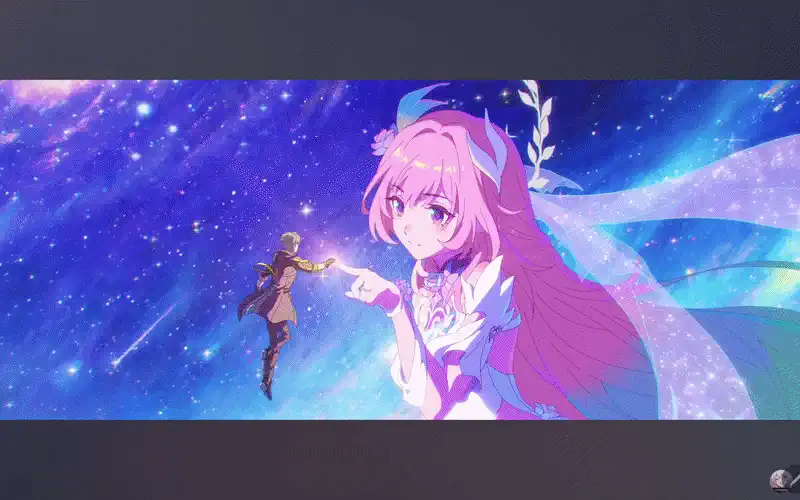

<div align="center">

```
█████╗ ███████╗████████╗███████╗ ██████╗      ██╗  ██╗
██╔══██╗╚══███╔╝╚══██╔══╝██╔════╝██╔════╝      ██║  ██║
███████║  ███╔╝    ██║   █████╗  ██║     █████╗███████║
██╔══██║ ███╔╝     ██║   ██╔══╝  ██║     ╚════╝██╔══██║
██║  ██║███████╗   ██║   ███████╗╚██████╗      ██║  ██║
╚═╝  ╚═╝╚══════╝   ╚═╝   ╚══════╝ ╚═════╝      ╚═╝  ╚═╝
```
<div align="center">
  
  

</div>

### This is Arsalaan. Hey There 👋
### developer · gamer · builder

*passionate about systems, games, and the tech that powers them*

[](mailto:arsalaankhan.work@gmail.com)

---

## 📅 Contribution calendar


---

</div>

## 🛠 Tech Stack

### ☁️ Cloud & Infrastructure


### 🐳 DevOps & Orchestration


### 💻 Languages


### 🌐 Backend & APIs


### 🗄️ Databases


### 📨 Messaging & Streaming


### 🤖 ML & Data


### 🎮 Game Dev & Creative


### 🧪 Testing & Tooling
