<div align="center">

```
█████╗ ██████╗ ███████╗ █████╗ ██╗      █████╗  █████╗ ███╗   ██╗
██╔══██╗██╔══██╗██╔════╝██╔══██╗██║     ██╔══██╗██╔══██╗████╗  ██║
███████║██████╔╝███████╗███████║██║     ███████║███████║██╔██╗ ██║
██╔══██║██╔══██╗╚════██║██╔══██║██║     ██╔══██║██╔══██║██║╚██╗██║
██║  ██║██║  ██║███████║██║  ██║███████╗██║  ██║██║  ██║██║ ╚████║
╚═╝  ╚═╝╚═╝  ╚═╝╚══════╝╚═╝  ╚═╝╚══════╝╚═╝  ╚═╝╚═╝  ╚═╝╚═╝  ╚═╝
```

### developer · gamer · builder

*passionate about systems, games, and the tech that powers them*

[](mailto:arsalaankhan.work@gmail.com)

</div>

---

## 👾 About

- 🤝 Open to collaborate on **game engines, networking, and DevOps projects**
- 🎮 Talk to me about **games, engines, and all things tech**
- 📬 Reach me at **arsalaankhan.work@gmail.com**

---

## 🎌 AniList


---

## 📅 Contribution calendar


## 🏆 Achievements  


---

## 🛠 Tech Stack

### ☁️ Cloud & Infrastructure

<p>
  
  
  
  
</p>

### 🐳 DevOps & Orchestration

<p>
  
  
  
  
  
  
  
</p>

### 💻 Languages

<p>
  
  
  
  
  
  
</p>

### 🌐 Backend & APIs

<p>
  
  
  
  
  
  
</p>

### 🗄️ Databases

<p>
  
  
  
  
  
  
  
  
</p>

### 📨 Messaging & Streaming

<p>
  
  
  
</p>

### 🤖 ML & Data

<p>
  
  
  
  
  
  
</p>

### 🎮 Game Dev & Creative

<p>
  
  
  
  
</p>

### 🧪 Testing & Tooling

<p>
  
  
  
  
  
</p>

---

<div align="center">
  
</div>
